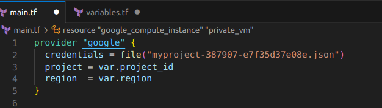
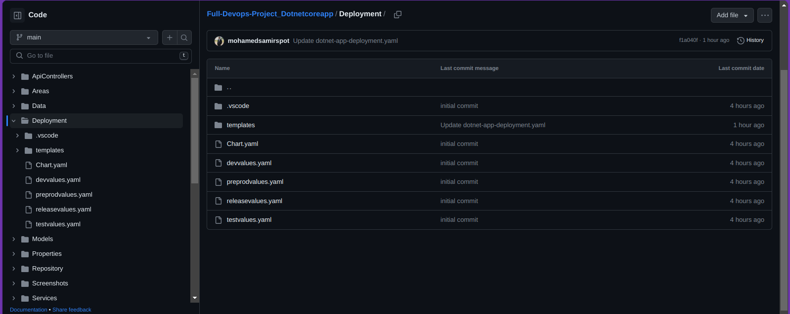
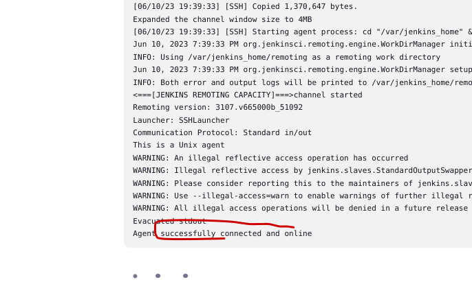
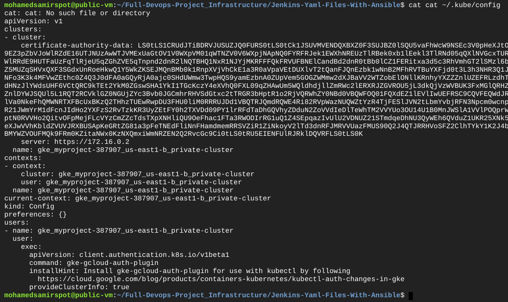
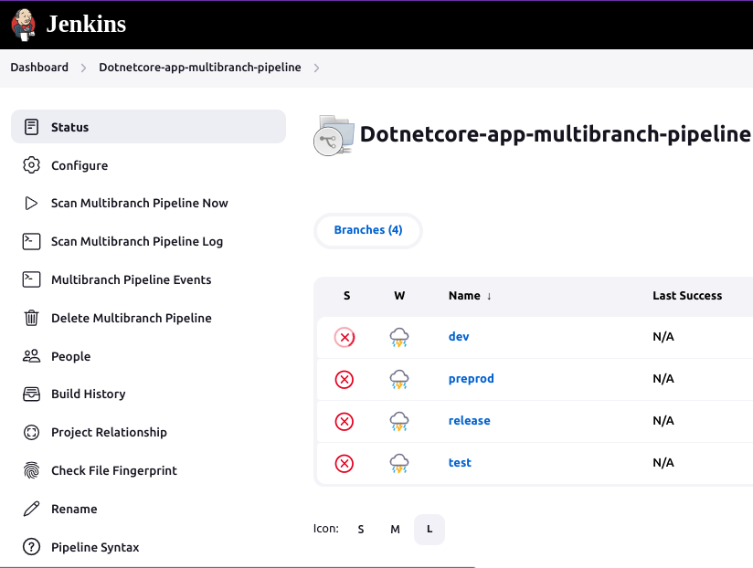

A full devops project to deploy my Asp.net core web app (news app) with mysql database in a full gitflow including 5 branches (test, dev, preprod, release) and the main branch to contain the base code.
Using these technologies and tools:
- `GCP (Google Cloud Platform)`
- `Dotnet core 7`
- `Mysql`
- `Terraform`
- `Ansible`
- `Helm`
- `Jenkins`
- `Docker`
- `Kubernates`
- `Github`
## You can find all the detailed steps on the readme files on the following repos 👇🏽
## Infrastructure: https://github.com/mohamedsamirspot/Full-Devops-Project_Infrastructure
## Dotnet App: https://github.com/mohamedsamirspot/Full-Devops-Project_Dotnetcoreapp

# Full-Devops-Project_Infrastructure:
in this infrastructure we are going to prepair the gcp infra using terraform for our kubernates cluster to deploy our jenkins and our app to it.

https://github.com/mohamedsamirspot/Full-Devops-Project_Dotnetcoreapp/assets/71722372/a4922dca-bed0-4c95-ab24-48c6c6460acf

## GCP Infrastructure includes:
- 1 VPC
- Backend for saving the tfstate file of terraform
- 2 subnets (management subnet & restricted subnet):
- NAT gateway over the restricted subnet
- Management subnet has the following:
  - Public VM
- Restricted subnet has the following:
  - private standard GKE cluster (private control plane and private worker nodes)

Firstly creating the required service account for our terraform

- Applying the terraform infrastructure code
  - firstly create the bucket first with all infra then uncomment the it and apply again

            terraform init
            terraform apply

  - for terraform init for the backend tfstate
  
      
      
            gcloud auth application-default login
            terraform init -upgrade
  - Now remove your local terraform.tfstate and terraform.tfstate.backup files

- Creating my key to access the vm

      ssh-keygen -t rsa -f /home/spot/.ssh/myvmkey

now copy the contents of the public key

  - Now navigate to this machine to put my public key file content

- Now configure this vm using ansible to install the required tools (like gcloud (to work with the cluster), kubectl, helm, ...)
  --> [Ansible files](ansible-vm-preparation)

      don't forget to get the public ip of the vm and put it in the inventory and vm-preparation.yml files
      ansible-playbook vm-preparation.yml

if you see this error

empty this file (known_hosts)

      

- Build and push the jenkins slave dockerfile with all the required tools installed on it --> [Salve-Pod-Dockerfile](Salve-Pod-Dockerfile)
    

      docker build --build-arg JENKINS_PASSWORD=<myubuntu-jenkins-userpassword> -t mohamedsamirebrahim/enhanced-slave-image:latest -f Salve-Pod-Dockerfile .
      docker push mohamedsamirebrahim/enhanced-slave-image:latest

- Now ssh to this public vm from your local machine to begin the work

- get clone the Infrastructure files to deploy jenkins

      git clone https://github.com/mohamedsamirspot/Full-Devops-Project_Infrastructure

- Deploy jenkins infrastructure (master and slave) using ansible --> [Ansible Jenkins yaml files](Jenkins-Yaml-Files-With-Ansible)

      cd Full-Devops-Project_Infrastructure
      cd Jenkins-Yaml-Files-With-Ansible
- Connect to the cluster

      gcloud container clusters get-credentials <privatecluster_name> --zone <zone_name> --project <project_id>

- run the playbook

      ansible-playbook ansible_jenkins.yaml

   
 

          kubectl get all -n jenkins

- And now at this point we have our infrastructure up and running with jenkins and its slaves as deployment on our GKE cluster
- Now access master jenkins pod using the service loadbalancer ip

      kubectl exec -it jenkins-master-pod-name -n jenkins -- bash
      cat /var/jenkins_home/secrets/initialAdminPassword

or just get it from logs
      
      kubectl logs jenkins-master-dep-6c68d86f64-qqvq2 -n jenkins

- preparing the branches of your app including the jenkins file, docker file and the helm chart to deploy the app

- Go to security and enable proxy compatibility

- Now go to credentials and create username and password credential for the slave jenkins user that we created before in the dockerfile of the slave

- Now set up the jenkins agent (slave)

- Create dockerhub credential

- Get the kubeconfig from any of the connectors to the api-server (node or pod that runs this before gcloud container clusters get-credentials <privatecluster_name> --zone <zone_name> --project <project_id>)

        cat ~/.kube/config

- now create a kubeconfig file with this content

- then create a secretfile credential to use this kubeconfig file content on Jenkinsfile as the service account is working inside the pod w can create anything but it doesn't work inside the jenkins file so it is useless in our project 😞 it require a plugin

- create the database credential for mysql of type secret text (❗❗Note: must be in base 64 format)
- which will be passed in the jenkinsfile helm command as a value variable to be passed to the creation of the db-secret yaml file in the cluster, then to be passed to the app, database deployments containers
- in my case i will create 4 secrets one in each namespace and use it through the current env

create multibranch pipeline

